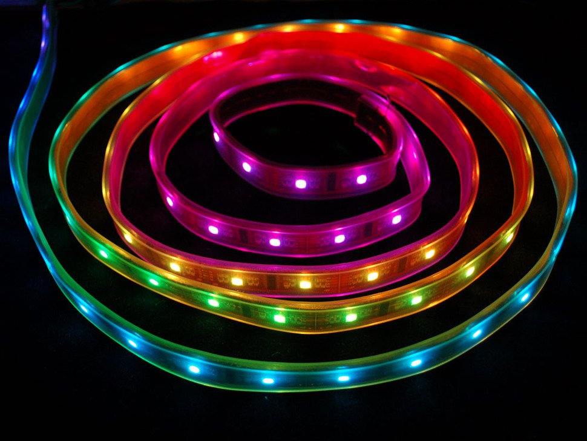

Z

# pilights - doing fancy things with RGB LED strips using Tcl and a Raspberry Pi

 

RGB LED strips are cool.  You write three bytes of RGB data to the strip and it sets the color of the first LED.  Shift registers built into the strip transfer the color previously set in the first LED into the second one, from the second LED to the third, etc.  Hundreds of LEDs can be updated tens of times a second with each LED capable of presenting one of millions of colors.

There are a number of different kinds of LED strips available.  Some are only a single color.  Some are RGB but all the LEDs show the same color.  Clearly, a string of LEDs where each is RGB and addressable has the most potential for making interesting and attractive patterns and sequences.

LED strips are built with a number of different driver chips to make each LED support individually controllable color settings.  Some require that the data be sent with very precise timing for delivering data and others even require that the data be continuously refreshed.

I elected to use RGB LED strips based on the LPD-8806 controller/driver chips.  It can do seven bits of color per channel for 21 bits per pixel, so each individual pixel can be set to one of a little over two million colors.  Also the LPD-8806 does not require precise timing or refreshing, which reduces complexity.

The strips have four wires.  One is for 5 volt DC power, one for ground, one for clock and one for data.  When the clock line is pulsed high, the high or low voltage on the data line is shifted into the shift registers of the LPD-8806.

Initial experiments were done using an Arduino single board computer programmed in C++, and produced numerous visually interesting patterns and animations.  

The decision to use the Arduino to animate the strip seemed pretty good.  It has a decent Java-based IDE that runs on Macs, Windows and Linux, and it was easy and reasonably quick to click to compile and click to download and have the program start playing.

With a few tens of Kbytes of flash and 4K of RAM and very low price, I reckoned the Arduino was just the sort of controller that would be used in a permanent, professional installation, and something that would run for years without problems and not require any sort of software maintenance.

Further, there was an Arduino library for talking to the LPD-8806.

```c
#include "LPD8806.h"
#include "SPI.h"

LPD8806 strip = LPD8806(160);

int pixel;
uint_32 color;

strip.setPixelColor(pixel, color);
strip.show();
```

After a while I had some stuff working.  I had wipes, which could animate a color fill from left to right or right to left.  fill_to_center animated a fill from the outside in while fill_from_center animated a fill from the middle out.

```c
void fill_to_center(uint32_t c, uint8_t wait) {
  int i;

  for (i=0; i < strip.numPixels() / 2; i++) {
      strip.setPixelColor(i, c);
      strip.setPixelColor(strip.numPixels() - i - 1, c);
      strip.show();
      delay(wait);
      if (stop) return;
  }
}
```

Since I wanted to be able to change the lightshow program without recompiling and reflashing the Arduino, so I even leveraged the minimal bitlash interpreter to provide a way to write functions that could invoke all these different patterns and store the functions in EEPROM on the Arduino.

At this point it was starting to feel a little clunky.  Bitlash is minimal and you still had to plug into USB to write or chage the functions.

After a while I started wanting to to make smooth, visually appealing color transitions.  This required dealing with colors using a Hue, Saturation and Value colorspace instead of the red green and blue values, or RGB, that gets set into the LEDs.  Lack of floating point on the processor meant working with scaled integers instead of float.  Complexity and inconvenience were increasing.

Since the Arduino only has 4K of RAM and each LED requires three bytes (well, 21 bits, but whatever) to set its color, once you go over 1365 LEDs there is more memory in the LED shift registers than there is on the machine.  By the way there's no way to read the registers back out. So this was really confining.

Switching to a more capable computer seemed really enticing.

The Raspberry Pi presented an appealing alternative.  One to four  gigabytes of RAM compared to the Arduino's four kilobytes.  So for each byte on the Arduino, a megabyte on the 4 gig Pi.  The Pi's four 64-bit CPUs clocking at 1.5 gigahertz versus the Arduino's single 8-bit CPU at 12 megahertz solved the performance problems. Its beefy capabilities and Linux operating system made it possible to consider running a powerful scripting language, Tcl, to control the lights.  Being able to ssh in and do compiles and installs and git pulls and commits and pushes natively on the target hardware offered greatly simplified development.  And the Pi's built in Wifi allowed me to physically unplug my laptop from the computer and LED strips.

Strips can be daisy-chained to create strips of almost unlimited length, although past a certain length the time required to set all the values will reduce the frequency at which the LEDs can be updated.

### Serial Peripheral Interface 

According to Wikipedia (https://en.wikipedia.org/wiki/Serial_Peripheral_Interface) the Serial Peripheral Interface (SPI) is a synchronous serial communication interface specification used for short-distance communication, primarily in embedded systems. The interface was developed by Motorola in the mid-1980s and has become a de facto standard. Typical applications include Secure Digital cards and liquid crystal displays.

SPI devices communicate in full duplex mode using a master-slave architecture with a single master. The master device originates the frame for reading and writing. Multiple slave-devices are supported through selection with individual slave select (SS), sometimes called chip select (CS), lines.  We do not use the chip select so we only have one strip 

The SPI bus is ideal for emitting data into an LED strip as it has a clock line and data line and the strips do as well.

All Raspberry Pi computers back to version one are equipped with an SPI bus that has two chip selects.  The newest version, the Pi 4, has six SPI buses.

The first problem, then, to writing light shows in Tcl was to be able to talk to the SPI bus from Tcl.

Ergo, I wrote the tclspi extension.

### tclspi - a direct Tcl interface to the Serial Peripheral Interface Bus on the Raspberry Pi

First we needed a way to write to the Serial Peripheral Interface Bus from Tcl.  I tclspi package was created to do this, and open-sourced it on github.

```tcl
package require spi
```

As is a fairly common approach used by Tcl extensions, the "spi" command creates a new Tcl command for controlling and manipulating the SPI bus.  It comprises about 500 lines of C code, and interfaces between Tcl and Linux system calls to talk to the SPI bus.

```tcl
set spi [spi #auto /dev/spidev0.0]

$spi read_mode 0
$spi write_mode 0
$spi write_bits_word 8
$spi read_bits_word 8
$spi write_maxspeed 500000
$spi read_maxspeed 500000

set transmitString "heya_kids_heya_heya_heya"

set receiveString [$spi transfer $transmitString 50]

puts "sent: $transmitString"
puts "recd: $receiveString"

$spi delete
```

The subcommands are "transfer", "read_mode", "write_mode", "read_bits_word", "write_bits_world", "read_maxspeed", "write_maxspeed", and "delete".

"read_mode" and "write_mode" select the SPI mode of 0, 1, 2 or 3.  It lets you select the clock polarity and phase of when data is sampled.  Mode 0 is the most common by far.

"read_bits_word" and "write_bits_word" set the number of bits per word.  The max on the Pi is 8 bits.

"read_maxspeed" and "write_maxspeed" set the read and write max speeds in hertz.

For talking to LED strips, we only need to write.

tclspi is open-sourced under the Berkeley copyright and available at https://github.com/lehenbauer/tclspi

### pilights

Once I could write to the SPI bus the next thing to do was write code to talk specifically to the LED strips.  In the first iteration of pilights I provided a way to set ranges of pixels to specific colors and create arrays of values and cycle through them.


, and can even use PNG, GIF and JPEG files and emit successive rows of pixels from the image to the corresponding LEDs.

The talk will include demos of both the Arduino and Tcl/pilights versions, with all supporting software fully open-sourced. 

You take a Raspberry Pi, load Debian Linux on it, grab tclspi to get Tcl access to the Serial Peripheral Interface Bus and pilights 


SCLK and MOSI


